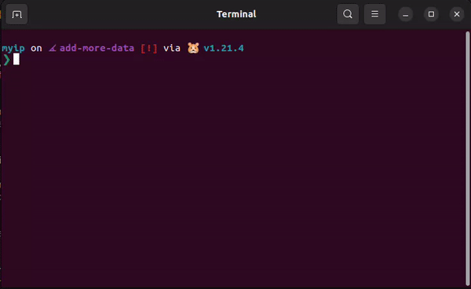

## MyIP

MyIP is a small Go application that retrieves information about your public and private IP addresses. It provides the data in either plain text or JSON format.



### Usage

#### Flags

- `-json`: Display results in JSON format.
- `-rich`: Display results in rich JSON format with additional information.

### Running the Tool

1. Clone the repository.
2. Navigate to the tool's directory.
3. Build the tool:
   ```
   go build myip
   ```
4. Run the tool:
   ```
   ./myip
   ```

### Example Usage

1. Display public and private IP addresses in plain text:
   ```
   ./myip
   ```
2. Display results in JSON format:
   ```
   ./myip -json
   ```
3. Display rich JSON format with additional information:
   ```
   ./myip -json -rich
   ```

### Output Formats

#### Plain Text

    Public IP    : <public_ip>
    Private IP   : <private_ip>
    (Additional information for rich format:
    Country      : <country>
    City         : <city>
    Region       : <region>
    Location     : <location>
    HostName     : <hostname>
    Organization : <organization>
    )

#### JSON Format

- Plain JSON:

```
    { "publicIP": "<public_ip>", "privateIP": "<private_ip>" }
```

- Rich JSON:

```
{
    "public IP": "<public_ip>",
    "private IP": "<private_ip>",
    "info": {
        "ip": "<public_ip>",
        "country": "<country>",
        "city": "<city>",
        "region": "<region>",
        "loc": "<location>",
        "org": "<organization>",
        "hostname": "<hostname>"
    }
}

```
